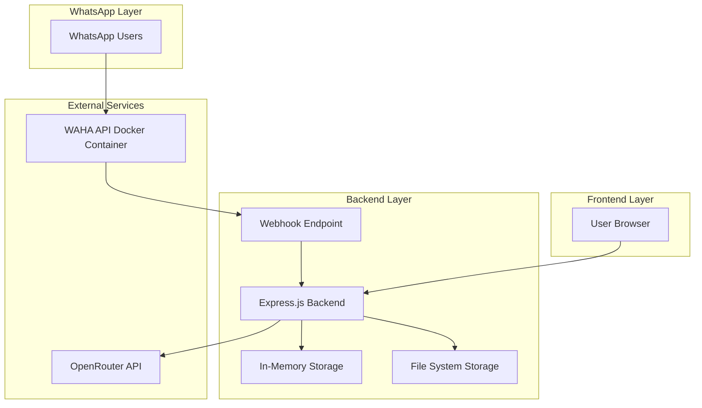
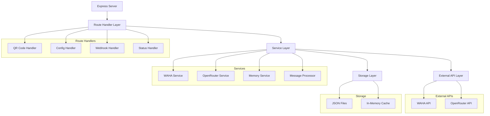
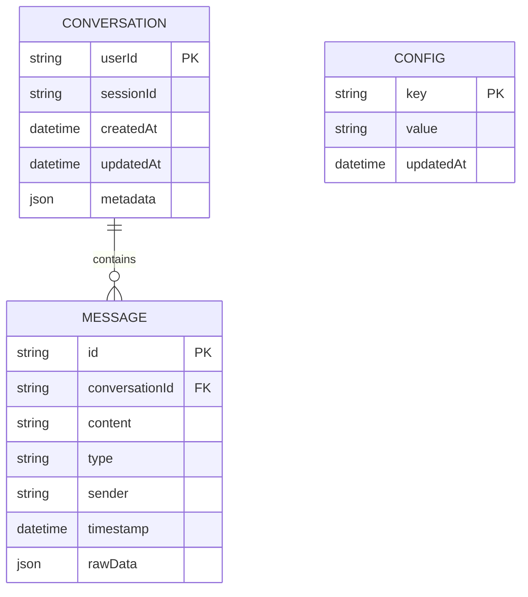

# WhatsApp AI Bot - Technical Architecture Document

## 1. Architecture Design



## 2. Technology Description

* Frontend: HTML5 + CSS3 + Vanilla JavaScript

* Backend: Node.js + Express.js + Axios

* Storage: JSON file system + In-memory cache

* External APIs: WAHA API (Docker), OpenRouter API

## 3. Route Definitions

| Route              | Purpose                                       |
| ------------------ | --------------------------------------------- |
| GET /              | Home dashboard with QR code and configuration |
| GET /qr            | Display QR code for WhatsApp authentication   |
| POST /config       | Configure OpenRouter API key and settings     |
| POST /webhook      | Receive incoming WhatsApp messages from WAHA  |
| GET /status        | Get connection and system status              |
| GET /conversations | View conversation history                     |

## 4. API Definitions

### 4.1 Core API

**Configuration Management**

```
POST /config
```

Request:

| Param Name       | Param Type | isRequired | Description                                 |
| ---------------- | ---------- | ---------- | ------------------------------------------- |
| openrouterApiKey | string     | true       | OpenRouter API key for AI model access      |
| aiModel          | string     | false      | AI model name (default: openai/gpt-4o-mini) |
| systemPrompt     | string     | false      | Custom system prompt for AI responses       |

Response:

| Param Name | Param Type | Description                 |
| ---------- | ---------- | --------------------------- |
| success    | boolean    | Configuration update status |
| message    | string     | Status message              |

Example:

```json
{
  "openrouterApiKey": "sk-or-v1-...",
  "aiModel": "openai/gpt-4o-mini",
  "systemPrompt": "You are a helpful WhatsApp assistant."
}
```

**Webhook Handler**

```
POST /webhook
```

Request:

| Param Name | Param Type | isRequired | Description                          |
| ---------- | ---------- | ---------- | ------------------------------------ |
| event      | string     | true       | Event type (message, session.status) |
| session    | string     | true       | WhatsApp session identifier          |
| payload    | object     | true       | Message data from WAHA               |

Response:

| Param Name | Param Type | Description                   |
| ---------- | ---------- | ----------------------------- |
| status     | string     | Processing status             |
| processed  | boolean    | Whether message was processed |

**Status Check**

```
GET /status
```

Response:

| Param Name           | Param Type | Description                         |
| -------------------- | ---------- | ----------------------------------- |
| wahaConnected        | boolean    | WAHA API connection status          |
| openrouterConfigured | boolean    | OpenRouter API configuration status |
| messagesProcessed    | number     | Total messages processed            |
| uptime               | string     | Server uptime                       |

## 5. Server Architecture Diagram



## 6. Data Model

### 6.1 Data Model Definition



### 6.2 Data Definition Language

**Configuration Storage (config.json)**

```json
{
  "openrouterApiKey": "",
  "aiModel": "openai/gpt-4o-mini",
  "systemPrompt": "You are a helpful WhatsApp assistant.",
  "wahaBaseUrl": "http://localhost:3000",
  "webhookUrl": "http://localhost:5000/webhook"
}
```

**Conversation Memory (conversations.json)**

```json
{
  "userId@c.us": {
    "sessionId": "default",
    "messages": [
      {
        "id": "msg_001",
        "content": "Hello",
        "type": "text",
        "sender": "user",
        "timestamp": "2024-01-01T10:00:00Z",
        "rawData": {}
      },
      {
        "id": "msg_002",
        "content": "Hi! How can I help you?",
        "type": "text",
        "sender": "ai",
        "timestamp": "2024-01-01T10:00:05Z",
        "rawData": {}
      }
    ],
    "createdAt": "2024-01-01T10:00:00Z",
    "updatedAt": "2024-01-01T10:00:05Z"
  }
}
```

**Session Status (status.json)**

```json
{
  "wahaConnected": true,
  "openrouterConfigured": true,
  "messagesProcessed": 42,
  "lastMessageAt": "2024-01-01T10:00:00Z",
  "uptime": "2h 30m",
  "errors": []
}
```

