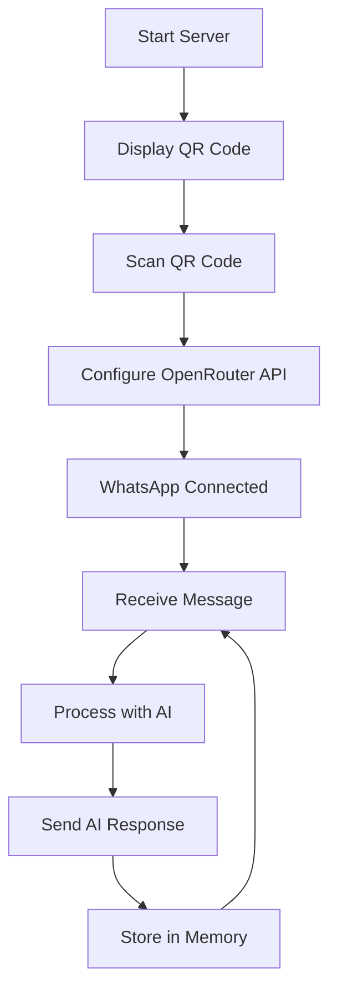

# WhatsApp AI Bot - Product Requirements Document

## 1. Product Overview
A Node.js backend application that integrates WAHA (WhatsApp HTTP API) with OpenRouter AI to create an intelligent WhatsApp chatbot. The system automatically responds to incoming WhatsApp messages using AI-generated responses while maintaining conversation context.

The product enables users to quickly deploy an AI-powered WhatsApp bot that can handle customer inquiries, provide automated responses, and maintain conversation history for personalized interactions.

## 2. Core Features

### 2.1 User Roles
| Role | Registration Method | Core Permissions |
|------|---------------------|------------------|
| Bot Administrator | Direct server access | Can configure OpenRouter API, view logs, manage bot settings |
| WhatsApp Users | WhatsApp messaging | Can send messages and receive AI responses |

### 2.2 Feature Module
Our WhatsApp AI Bot consists of the following main components:
1. **QR Code Display Page**: QR code generation and display for WhatsApp authentication
2. **Configuration Dashboard**: OpenRouter API key setup and bot configuration
3. **Message Processing Engine**: Webhook handling and AI response generation
4. **Memory Management System**: Conversation history and context storage

### 2.3 Page Details
| Page Name | Module Name | Feature description |
|-----------|-------------|---------------------|
| QR Code Display | Authentication | Display QR code from WAHA API for WhatsApp pairing, auto-refresh until connected |
| Configuration Dashboard | API Setup | Configure OpenRouter API key, select AI model (default: openai/gpt-4o-mini), test connection |
| Webhook Endpoint | Message Handler | Receive incoming WhatsApp messages, process through AI, send responses back |
| Memory System | Context Storage | Store conversation history per user, maintain context for personalized responses |
| Status Monitor | Health Check | Display connection status, message statistics, error logs |

## 3. Core Process
**Administrator Flow:**
1. Start the Node.js backend server
2. Access QR code display page to authenticate WhatsApp
3. Configure OpenRouter API key in dashboard
4. Monitor incoming messages and AI responses

**User Flow:**
1. Send message to connected WhatsApp number
2. System receives message via webhook
3. AI processes message with conversation context
4. System sends AI-generated response back to user
5. Conversation history is stored for future context

## 4. User Interface Design
### 4.1 Design Style
- Primary colors: WhatsApp Green (#25D366), Dark Gray (#2A2A2A)
- Secondary colors: Light Gray (#F5F5F5), White (#FFFFFF)
- Button style: Rounded corners with subtle shadows
- Font: Inter or system default, sizes 14px-24px
- Layout style: Clean dashboard with card-based components
- Icons: Material Design icons for consistency

### 4.2 Page Design Overview
| Page Name | Module Name | UI Elements |
|-----------|-------------|-------------|
| QR Code Display | Authentication | Centered QR code image, connection status indicator, refresh button |
| Configuration Dashboard | API Setup | Input fields for API key, dropdown for model selection, test connection button |
| Status Monitor | Health Check | Real-time status cards, message counter, error log table |

### 4.3 Responsiveness
Desktop-first design with mobile-responsive layout for monitoring on various devices. Touch-friendly interface for mobile access to configuration and status monitoring.